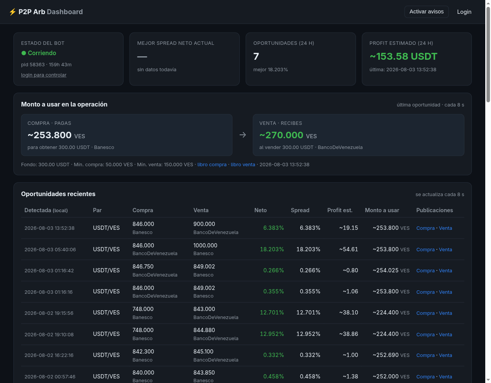
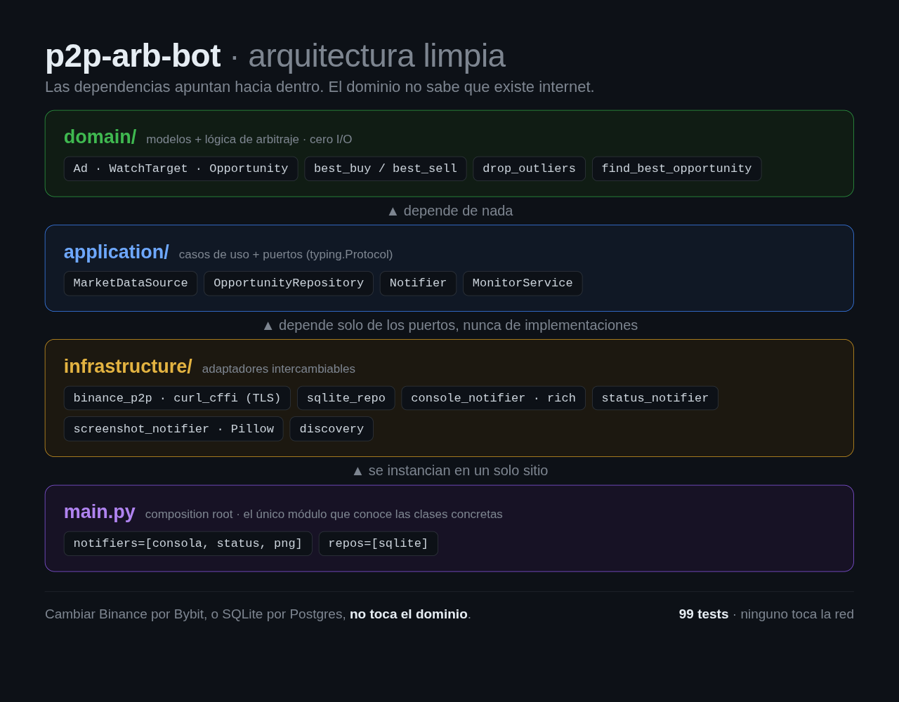
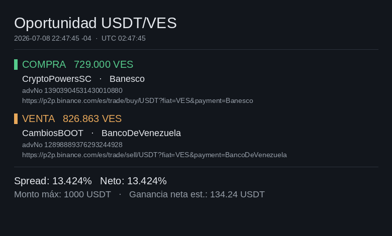

# P2P Arb Bot — Monitor de arbitraje Binance P2P (USDT/VES)

Bot en Python que **monitorea** el mercado P2P de Binance para un par (por
defecto USDT/VES), detecta oportunidades de arbitraje (spread entre el mejor
precio de compra y el mejor de venta) según los métodos de pago y el capital en
moneda fiat que indiques, **avisa por consola** cuando la ganancia neta supera un
umbral, y guarda cada oportunidad en **SQLite** con el % de ganancia y los
enlaces al mercado filtrado de compra y venta.

> ⚠️ **El bot SOLO monitorea y avisa.** No ejecuta operaciones, no publica
> anuncios y **no** usa API keys de trading de Binance. Usa únicamente el
> endpoint público de búsqueda de anuncios.



*Instancia en vivo: <https://arbitragebot.automateca.site/> (supervisión pública;
arrancar, parar y configurar exigen login).*

## Arquitectura

Arquitectura limpia con dependencias apuntando hacia el dominio:



```
src/p2p_arb_bot/
├── domain/          # Modelos puros + lógica de arbitraje (sin I/O, testeable)
│   ├── models.py
│   └── arbitrage.py
├── application/     # Casos de uso + puertos (Protocols)
│   ├── ports.py     # MarketDataSource, OpportunityRepository, Notifier
│   └── monitor.py   # MonitorService: buscar → analizar → persistir → notificar
├── infrastructure/  # Adaptadores concretos
│   ├── binance_p2p.py     # MarketDataSource con curl_cffi (async, impersonation TLS)
│   ├── discovery.py       # Descubre métodos de pago disponibles
│   ├── sqlite_repo.py     # OpportunityRepository (SQLite)
│   └── console_notifier.py# Notifier (rich)
├── config.py        # Configuración tipada + carga .env
└── main.py          # Composition root: wiring, CLI, loop, cierre limpio
```

La inversión de dependencias (puertos con `typing.Protocol` + inyección por
constructor) permite cambiar piezas sin tocar el núcleo: otra fuente de datos
(Bybit/OKX), otro repositorio (Postgres/CSV) u otro notificador (Telegram,
webhook). Notificadores y repositorios se pasan como **listas**, así puedes
combinar varios a la vez. La configuración admite una lista de *watch targets*,
de modo que escalar a multi-par / multi-fiat no requiere cambios estructurales.

## Instalación

```bash
python -m venv venv
source venv/bin/activate
pip install -r requirements.txt
pip install -e .          # registra el paquete (src/) y el comando p2p-arb-bot
```

Requiere Python 3.11+. El `pip install -e .` es lo que permite ejecutar
`python -m p2p_arb_bot.main`; sin él, el paquete vive en `src/` y Python no lo
encuentra. (Alternativa sin instalar: `PYTHONPATH=src python -m p2p_arb_bot.main`.)

## Uso

```bash
cp .env.example .env   # opcional: ajusta valores por defecto
python -m p2p_arb_bot.main
```

Al arrancar, el bot:

1. Descubre los métodos de pago disponibles para el par y los muestra numerados.
2. Te pide elegir uno o varios (Enter = todos), el fondo máximo en fiat, el
   umbral de ganancia %, el buffer de fees %, el intervalo de polling y si
   filtrar solo comerciantes verificados. Cada prompt usa el valor del `.env`
   como predeterminado (Enter para aceptarlo).
3. Entra en bucle: consulta ambos lados (BUY/SELL) en paralelo, calcula el
   mejor spread (incluyendo **pares cruzados** entre métodos), y:
   - Si hay oportunidad ≥ umbral: imprime un panel destacado con % neto/bruto,
     precios, métodos y los **dos enlaces al mercado filtrado** (compra y venta),
     y la guarda en SQLite.
   - Si no: imprime una línea de estado discreta (heartbeat) con el mejor
     spread actual.

Para correr **sin interacción** (cron/servidor), pon `NO_INPUT=true` en `.env`
y define el resto de variables.

`Ctrl+C` cierra la conexión HTTP y la base de datos de forma limpia.

## Dashboard web

Un dashboard (FastAPI + HTMX) permite **supervisar, ejecutar y configurar** el bot
desde el navegador. La **supervisión es pública** (no requiere login); **arrancar /
parar el bot y editar la configuración exigen contraseña**.

```bash
make dashboard      # local: http://localhost:8000
```

Configura antes en `.env`:

- `DASHBOARD_PASSWORD` — contraseña para las acciones protegidas (sin ella, el
  dashboard queda en modo solo-lectura).
- `DASHBOARD_SECRET` — secreto para firmar la cookie de sesión
  (`python -c "import secrets; print(secrets.token_hex(32))"`).
- `DASHBOARD_HOST` / `DASHBOARD_PORT` — interfaz y puerto (por defecto `0.0.0.0:8000`).

Qué ofrece:

- **Supervisar** (público): estado del bot (corriendo/detenido + uptime), mejor
  spread neto actual, oportunidades de las últimas 24 h, profit estimado, tabla de
  oportunidades recientes y las últimas líneas del log. Todo se auto-refresca.
- **Ejecutar** (login): botones de arrancar / parar / reiniciar. El dashboard
  gestiona el bot como subproceso.
- **Configurar** (login): edita los parámetros clave (umbral %, fondo máximo fiat,
  métodos de pago, intervalo) y los aplica reiniciando el bot. Escribe en `.env`
  preservando el resto de claves.

El estado en vivo lo alimenta un `StatusNotifier` que el bot añade a su lista de
notifiers: vuelca el último heartbeat/oportunidad a `STATUS_PATH` (`status.json`),
así el dashboard no necesita pegarle a Binance por su cuenta.

### Mercado reciente y revalidación

El dashboard separa **Mercado reciente** del **Historial de oportunidades**.
Cada ruta muestra primera observación, última comprobación y última observación
favorable. Las consultas repetidas actualizan su vigencia aunque se suprima un
aviso duplicado. Los tiempos de seguimiento se muestran en UTC.

Un libro con más de `MARKET_FRESHNESS_S` segundos se marca **sin datos recientes**
(por defecto, dos intervalos de barrido). Un error conserva el último libro
válido: no significa que desaparecieron los anuncios. **No observada** indica
que la ruta no apareció en las filas consultadas; no confirma su expiración.
Las agrupaciones usan contrapartes, identificadores observados y métodos: no
certifican identidad exacta porque Binance puede devolver `advNo` redondeados.

Con sesión, **Comprobar de nuevo** envía una solicitud al bot por una cola privada
(`CONTROL_DB_PATH`). El bot debe estar corriendo. Consulta ambos lados usando la
misma fuente, concurrencia y backoff del monitor, y muestra precios anteriores y
nuevos o el motivo de incompatibilidad. Una contraparte distinta se presenta
como alternativa. La comprobación no reserva anuncios ni garantiza el cierre.

Los episodios y cambios observados se retienen `MARKET_RETENTION_DAYS` días; las
rutas seguidas se limitan con `MARKET_MAX_ROUTES`. El historial de oportunidades
y los snapshots de operaciones se conservan independientemente.

### Fondos por banco o método de pago

La pantalla **Fondos** requiere login. Permite declarar cuentas, su moneda,
saldo total, métodos de Binance asociados y si puedes recibir pagos. Por
ejemplo, `Banesco,PagoMovil` puede representar dos métodos respaldados por una
misma cuenta: su saldo no se suma dos veces. Los identificadores deben coincidir
con los métodos mostrados por el monitor.

- **Disponible = saldo declarado − reservas activas.** Las reservas se crean y
  liberan explícitamente; no implican una transferencia ni una orden en Binance.
- El saldo declarado incluye las reservas. Registrar una operación no modifica
  saldos automáticamente: actualízalos con lo que realmente ocurrió.
- Las recomendaciones evalúan cada cuenta de compra por separado, acotadas por
  `MAX_FIAT`, límites e inventario de ambos anuncios. Pueden usar menos que el
  fondo global. El banco receptor requiere habilitación para recibir, no saldo.
- Una recomendación muestra incompatibilidades y el déficit para el mínimo.
  Si no hay cuentas configuradas, lo indica sin asumir un saldo bancario.
- Revalidar con los fondos actuales habilita **Reservar fondos**. Cambiar saldos
  o métodos invalida esa comprobación para reservar; el servidor vuelve a
  evaluar la capacidad y verifica versiones dentro de una transacción.

El dimensionamiento redondea las unidades cripto hacia abajo a ocho decimales,
como la presentación del dashboard, para no recomendar una reserva mayor que el
saldo por errores de redondeo. El importe sobrante permanece disponible.

Desde las rutas personalizadas puedes registrar una operación o un intento
fallido. El formulario conserva la versión de fondos y, cuando corresponde,
la comprobación utilizada junto al estimado; sobrevive a la limpieza del
historial y a la caducidad de la cola. El panel de comprobaciones muestra su
tiempo medio, porcentaje favorable y motivos de incompatibilidad del periodo
retenido. Son consultas observadas, no beneficios realizados.

Las alternativas compiten por el mismo capital y no son ganancias acumulables.
Los saldos, reservas y comprobaciones personales se guardan en bases privadas;
la supervisión pública solo muestra mercado. `TRADES_DB_PATH` conserva cuentas,
reservas y operaciones; debe ser distinto de `DB_PATH` y `CONTROL_DB_PATH`.
Docker persiste las tres bases en `/data`.

La primera versión sirve al operador único del dashboard y utiliza actualización
manual. No integra bancos, cartera cripto ni transferencias entre cuentas.

En Docker el dashboard es el **contenedor principal** y arranca el bot como
subproceso (ver más abajo).

### Fichas de oportunidad (opcional)

Las oportunidades P2P son efímeras: cuando abres el enlace, los anuncios que las
producían ya suelen haber expirado. Con `SCREENSHOTS=true` el bot dibuja con Pillow
—sin navegador— una ficha PNG en `SCREENSHOTS_DIR` en el instante de la detección,
con las dos piernas de la operación y la aritmética del spread:



Está **apagado por defecto** (es una función de desarrollo: genera un PNG por
oportunidad y llena el disco si el umbral es bajo).

## Despliegue con Docker

Requiere Docker con el plugin Compose. El contenedor corre el **dashboard web**
(`http://localhost:8000`), que arranca/para el bot como subproceso en modo **no
interactivo** (`NO_INPUT=true`). La configuración se toma de variables de entorno /
`.env`. La base de datos, los logs y el estado se guardan en un volumen
(`arb-data`, montado en `/data`) que persiste entre reinicios; el `.env` se
bind-montea para que la edición desde el dashboard persista.

```bash
make env            # crea .env desde .env.example (ajústalo a tu gusto)
make docker-up      # construye y levanta el dashboard en segundo plano
make docker-logs    # sigue la salida
make docker-down    # detiene y elimina el contenedor
```

Luego abre `http://localhost:8000` y arranca el bot desde el dashboard (necesitas
`DASHBOARD_PASSWORD` en `.env`).

O directamente con Compose:

```bash
cp .env.example .env
docker compose up -d --build
docker compose logs -f
```

En modo no interactivo no hay menú de métodos: define `PAY_METHODS` en `.env`
(vacío = vigilar todos) junto con `MAX_FIAT`, `THRESHOLD_PCT`, etc. Para
**descubrir métodos** o configurar a mano dentro del contenedor, lánzalo
interactivo:

```bash
make docker-run     # corre el bot interactivo dentro del contenedor del dashboard
```

El contenedor necesita **salida a Internet** hacia `p2p.binance.com`. Si tu red
de Docker la bloquea o Binance limita la IP, define `PROXY` en `.env` (se respeta
dentro del contenedor) o ajusta la red del host. Errores `curl: (28) timed out`
en los logs indican precisamente falta de egress.

### Makefile

`make` (o `make help`) lista todos los objetivos: `install`, `test`, `run`,
`dashboard`, `clean`, `env`, y los `docker-*` (`docker-build`, `docker-up`,
`docker-down`, `docker-logs`, `docker-run`, `docker-shell`).

### Terminología

- `BUY`  → anuncios donde **tú compras** USDT (precio que pagas). El mejor es el
  **más bajo**.
- `SELL` → anuncios donde **tú vendes** USDT (precio que recibes). El mejor es el
  **más alto**.

Hay oportunidad cuando `best_sell > best_buy` y `net_pct ≥ umbral`, con
`net_pct = spread_pct − fee_buffer_pct`.

### Interpretar el heartbeat (`sin datos / sin pares elegibles`)

Cuando **no** hay oportunidad, el bot imprime una línea de estado (heartbeat) en
lugar de un panel. Puede decir dos cosas:

- **`mejor spread neto X%`** — sí encontró al menos una pareja compra/venta
  elegible, pero el mejor spread quedó por debajo de tu umbral. Es lo normal la
  mayor parte del tiempo.
- **`sin datos / sin pares elegibles`** — en ese ciclo **no encontró ni una sola
  pareja compra-venta con la que calcular un spread**. No es un error: el bot está
  avisando honestamente de que no había nada que comparar.

Para poder comparar, el bot necesita **al menos un anuncio de compra Y uno de
venta que sobrevivan a estos 4 filtros** (`domain/arbitrage.py`, función
`_eligible`). Si **cualquiera de los dos lados** queda vacío, no hay par →
`sin datos / sin pares elegibles`:

1. **Método de pago** — que el anuncio use uno de tus `PAY_METHODS`
   (vacío = se aceptan todos).
2. **Acepta tu monto** (`accepts_amount`) — que `MAX_FIAT` quepa entre los
   mínimos y máximos de compra. Para la venta, se validan las unidades compradas
   multiplicadas por el precio de venta: su importe fiat puede ser distinto.
3. **Inventario** (`has_inventory`) — que haya unidades suficientes para cubrir
   la compra (`MAX_FIAT / precio_compra`) y la venta de esas mismas unidades.
4. **Outliers** — que el precio no se desvíe de la mediana más de
   `OUTLIER_MAX_DEV_PCT` (descarta precios "cebo"). `0` desactiva este filtro.

Si ves ese mensaje de forma persistente y **sin que se registren oportunidades**
(la tabla `opportunities` sigue vacía), casi siempre es por **configuración
demasiado restrictiva**, no por un fallo de red: revisa `MAX_FIAT` (prueba un
valor que encaje con los límites típicos del par), reduce la lista de
`PAY_METHODS` o déjala vacía, y afloja/ajusta `OUTLIER_MAX_DEV_PCT`. Que el bot
traiga anuncios pero no forme pares confirma que el egress a Binance funciona; el
cuello de botella son los filtros de elegibilidad.

El historial del monitor conserva la evaluación del fondo completo. La vista
de mercado reciente y las recomendaciones por cuenta también consideran montos
menores: pueden mostrar rutas compatibles aunque el fondo completo no encaje.

## Base de datos

Tabla `opportunities` (SQLite, ruta en `DB_PATH`) con `detected_at`, par,
métodos de cada pierna, precios, `spread_pct`, `net_pct`, `max_usdt`, los
`advNo` de cada anuncio, anunciantes, los enlaces a cada publicación y `est_profit_usdt`
(ganancia neta estimada en USDT = `max_usdt * net_pct / 100`). Índice por
`detected_at`. Las BDs creadas con un esquema anterior se migran solas al
arrancar (se añade la columna nueva si falta).
Se evitan duplicados idénticos (mismos `advNo` + precios) dentro de una ventana
de 60 s.

Consulta rápida:

```bash
sqlite3 opportunities.db "SELECT detected_at, net_pct, buy_price, sell_price FROM opportunities ORDER BY detected_at DESC LIMIT 10;"
```

## Configuración (.env)

Todas las variables están documentadas en [`.env.example`](.env.example). Las
más relevantes: `ASSETS`, `FIAT`, `PAY_METHODS`, `MAX_FIAT`, `THRESHOLD_PCT`,
`FEE_BUFFER_PCT`, `MERCHANT_CHECK`, `POLL_INTERVAL_S`, `DB_PATH`, `IMPERSONATE`,
`PROXY`, `BEEP`, `NO_INPUT`.

### Anti-bloqueo

El endpoint puede hacer fingerprinting TLS/JA3, por lo que `requests`/`httpx`
pueden bloquearse. Se usa `curl_cffi` con `impersonate="chrome"`, que replica el
handshake de Chrome sin necesidad de navegador. Hay backoff exponencial con
jitter ante 403/429/timeouts, validación de `success:true` (un 200 no basta) y
polling con jitter. Se soporta proxy opcional vía `PROXY`/`HTTPS_PROXY` (sin
credenciales en el código).

## Tests

```bash
pytest
```

Los tests cubren la capa de dominio (spread, filtrado por límites, pares
cruzados) y el caso de uso (persistencia, supresión de duplicados, heartbeats,
múltiples adaptadores) usando fakes, **sin red ni disco**.

## Licencia

MIT — ver [LICENSE](LICENSE). La fuente Liberation Sans empaquetada en
`src/p2p_arb_bot/infrastructure/fonts/` conserva su propia licencia (SIL OFL).
